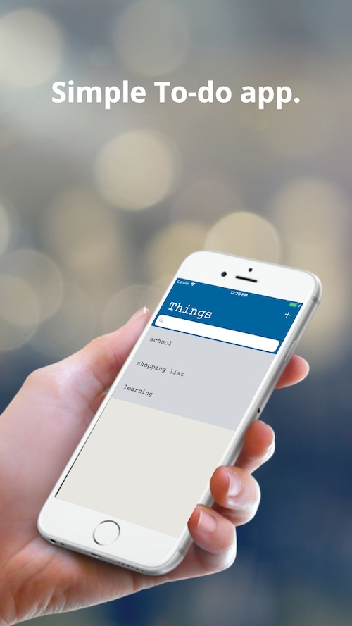
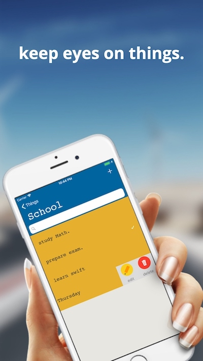

#  Things

## App Screenshot

### 學習資源
- 透過 Angela 在 Udemy 上的教學來完成 TableView 以及 Realm 的練習
- 使用 Realm 讓資料儲存在本地裝置
- 透過 SwipeCellKit 讓 TableView Cell 有滑動編輯的效果
- 使用 ChameleonFramework 的顏色來設計畫面

---

### 使用到的第三方函式

- SwipeCellKit
- RealmSwift
- ChameleonFramework

---
### 未完成

- 需再增加功能
- 滑動 cell 的效果有問題
- 使用者設定

